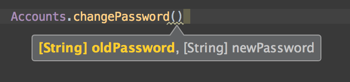
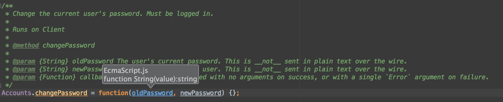

#DEPRECATED

Webstorm officially support Meteor now

Meteor Webstorm Library
=======================
Although Webstorm have [announced Meteor support in v9](http://confluence.jetbrains.com/display/WI/Roadmap+for+WebStorm+9), they previously [announced it for v8](http://confluence.jetbrains.com/display/WI/Roadmap+for+WebStorm+8) but didn't do it. I'm sure they have their reasons but until then, this will hopefully help a little. We'll continue to support this until official support comes out.

Other IDE's may work too as the library is simply a stub with JSDoc documentation.

What does it do?
----------------

This is what you'll get in Webstorm as you type methods:

And if you click-through to the method declaration you'll get this:

Installation Instructions:
--------------------------
* Open Webstorm preferences and go to Javascript > Libraries
* Click on "Add" and then click on "Specify" and paste in this url: https://raw.githubusercontent.com/xolvio/meteor-webstorm/master/meteor-webstorm-library.js
* Enjoy!

How did we do it?
-----------------
We wrote a converter that takes the [api.json](https://github.com/meteor/meteor/blob/devel/docs/client/api.js), which powers the [Meteor docs site](docs.meteor.com), and converts it into a stub with jsdocs ([Inspired by this post](http://youtrack.jetbrains.com/issue/WEB-6264#comment=27-615870)).

Done / Remaining:
-----------------
Methods converted so far:
* Static methods like `Meteor.isServer`. These are the easiest and there are 
79 of them.

Methods pending conversion:
* Instance methods, these require some fiddling and there are 53 of them.
* Instances set on static objects, should be easy and there are 6.
* Some weird prototype thing of which there's 1.

Other tasks remaining:
* Convert markdown links to JSDocs @link
* Extract return args from description
